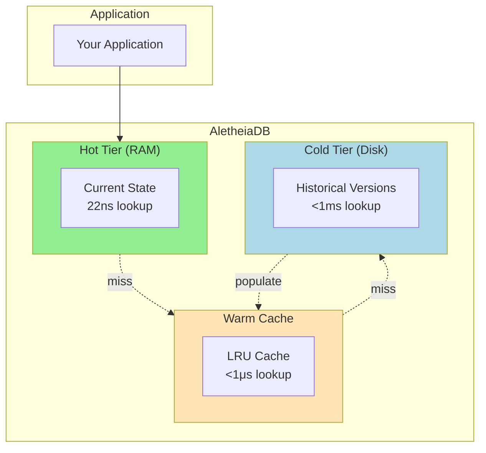
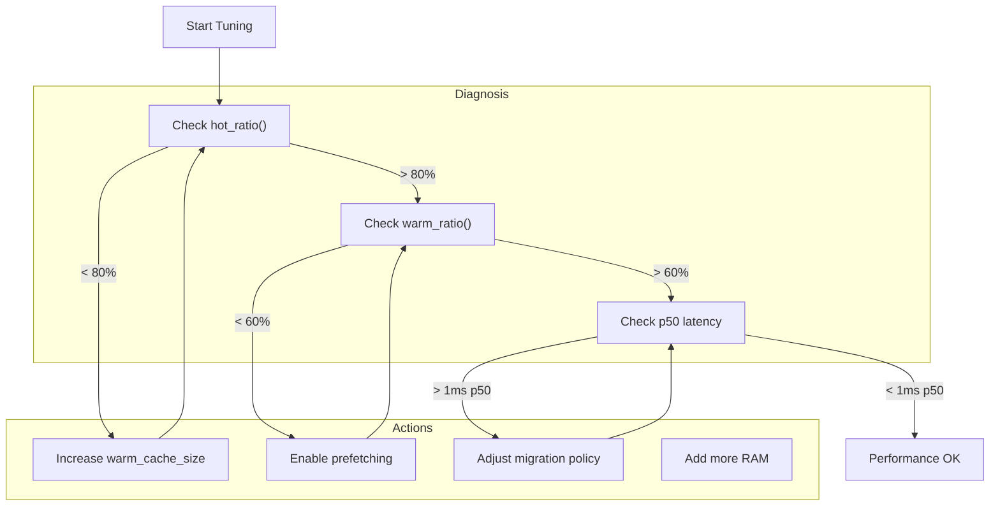
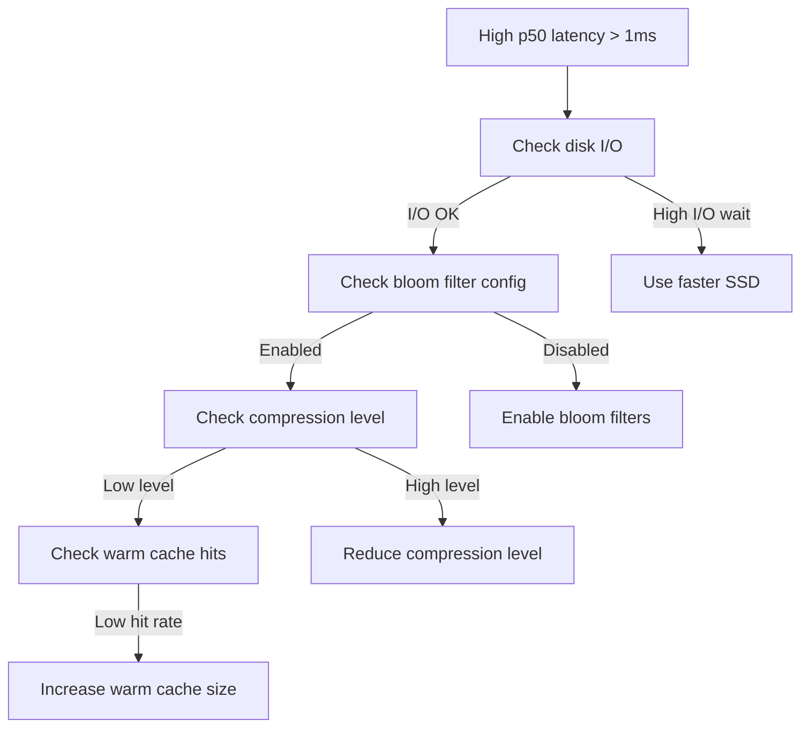

# Tiered Storage Guide

This guide explains how to configure and use AletheiaDB's tiered storage feature for storing historical versions on disk while keeping current state in memory.

## Overview

AletheiaDB's tiered storage architecture enables:
- **Unlimited historical depth**: Store years of temporal history
- **Preserved performance**: Current-state queries remain at 22-70ns
- **Cost-effective**: SSD storage is 10-100x cheaper than RAM



## Quick Start

### Basic Setup (Redb Cold Storage)

Redb is a pure Rust embedded database that provides excellent performance without
external dependencies. It's the recommended backend for production deployments.

**Recommended: Unified Configuration (v0.1.0+)**

```rust
use aletheiadb::{AletheiaDB, config::AletheiaDBConfig};
use aletheiadb::config::HistoricalConfigBuilder;
use std::time::Duration;

// Configure cold storage via the unified config builder
let config = AletheiaDBConfig::builder()
    .historical(
        HistoricalConfigBuilder::new()
            .enable_cold_storage(true)
            .cold_storage_path("data/cold.redb")
            .migration_age_threshold(Duration::from_secs(3600)) // 1 hour
            .max_hot_versions(1000)
            .build(),
    )
    .build();

// Cold storage automatically initialized!
let db = AletheiaDB::with_unified_config(config)?;
```

**Legacy: Manual Setup**

For advanced use cases requiring custom backends:

```rust
use aletheiadb::storage::{
    HistoricalStorage, TieredStorage, TieredStorageConfig,
    RedbColdStorage, RedbConfig,
};
use std::sync::Arc;

let mut historical = HistoricalStorage::new();

// 1. Create Redb cold storage
let cold = Arc::new(RedbColdStorage::new("data/cold.redb", RedbConfig::new())?);

// 2. Create tiered storage
let tiered = TieredStorage::new(TieredStorageConfig::default(), cold);

// 3. Wire to historical storage
historical.set_tiered_storage(Arc::new(tiered));
```

## Configuration

### TieredStorageConfig

```rust
pub struct TieredStorageConfig {
    /// Size of warm cache (number of entries per type)
    /// Default: 10,000
    pub warm_cache_size: usize,

    /// Enable prefetching of version chains
    /// Default: true
    pub enable_prefetch: bool,

    /// Maximum versions to prefetch in a chain
    /// Default: 5
    pub prefetch_depth: usize,

    /// Memory budget (entry count) for the in-memory cold changefeed directory used by the
    /// `list_changes` cold-tier pushdown (Issue #3677). Each entry is one `ChangeCursor`
    /// (~5 machine words). Default: 1,000,000 (~40-50 MB). `0` disables the directory, so every
    /// cold `list_changes` scan degrades to the (correct) full scan.
    pub cold_change_directory_max_entries: usize,
}
```

**Tuning Tips:**
- Increase `warm_cache_size` if you have frequent time-travel queries
- Disable `enable_prefetch` if your queries are random access (not following chains)
- Reduce `prefetch_depth` to save memory if chains are short
- Lower `cold_change_directory_max_entries` (or set `0`) to cap/disable the cold changefeed
  directory's memory; queries over windows beyond the retained newest region degrade to a full scan

### RedbConfig (Cold Storage)

```rust
pub struct RedbConfig {
    /// Compression algorithm for values
    /// Default: Zstd
    pub compression: CompressionAlgorithm,

    /// Compression level (1-22 for Zstd)
    /// Default: 3
    pub compression_level: u32,

    /// Cache size in bytes
    /// Default: 128MB
    pub cache_size: usize,
}
```

**Creating Configurations:**

```rust
// Default configuration
let config = RedbConfig::new();

// With custom cache size
let config = RedbConfig::new().with_cache_size(256 * 1024 * 1024); // 256MB
```

## Migration

### MigrationPolicy

```rust
pub struct MigrationPolicy {
    /// Migrate versions older than this duration
    /// Default: 7 days
    pub age_threshold: Duration,

    /// Migrate when memory exceeds this threshold
    /// Default: 1GB
    pub memory_threshold_bytes: usize,

    /// Keep at least this many versions in hot tier
    /// Default: 1 (current only)
    pub min_hot_versions: usize,

    /// Maximum versions per migration batch
    /// Default: 1000
    pub batch_size: usize,

    /// Interval between migration runs
    /// Default: 60 seconds
    pub run_interval: Duration,

    /// Enable/disable migration
    pub enabled: bool,
}
```

**Preset Policies:**

```rust
// Aggressive: migrate quickly, save memory
let policy = MigrationPolicy::aggressive();

// Conservative: keep more in memory
let policy = MigrationPolicy::conservative();

// Disabled: no automatic migration
let policy = MigrationPolicy::disabled();

// Custom
let policy = MigrationPolicy::builder()
    .age_threshold(Duration::from_secs(24 * 60 * 60)) // 1 day
    .min_hot_versions(3)
    .batch_size(500)
    .build();
```

### Manual Migration

```rust
use aletheiadb::storage::{MigrationService, MigrationPolicy};
use std::sync::Arc;

// Create migration service
let policy = MigrationPolicy::default();
    // Assuming you have access to the cold storage instance
    // let migration = MigrationService::new(tiered.cold_storage().clone(), policy);

// Trigger migration from historical storage
    // let migrated_count = historical.migrate_to_cold(&migration)?;
println!("Migrated {} versions", migrated_count);
    Ok(())
}
```

### Migration Callbacks

```rust
use aletheiadb::storage::migration::MigrationCallback;

struct LoggingCallback;

impl MigrationCallback for LoggingCallback {
    fn before_node_migration(&self, version: &NodeVersion) -> bool {
        println!("Migrating node version {}", version.id.as_u64());
        true // return false to skip
    }

    fn after_batch(&self, node_count: usize, edge_count: usize) {
        println!("Batch complete: {} nodes, {} edges", node_count, edge_count);
    }

    fn on_error(&self, error: &str) {
        eprintln!("Migration error: {}", error);
    }
}

let callback = Arc::new(LoggingCallback);
let service = MigrationService::with_callback(cold, policy, callback);
```

## Monitoring

### Metrics

```rust
// Get tiered storage metrics
let metrics = historical.tiered_storage().unwrap().metrics();

println!("Hot hits: {}", metrics.hot_hits);
println!("Warm hits: {}", metrics.warm_hits);
println!("Cold hits: {}", metrics.cold_hits);
println!("Misses: {}", metrics.misses);
println!("Prefetches: {}", metrics.prefetches);

// Computed ratios
println!("Hot ratio: {:.2}%", metrics.hot_ratio() * 100.0);
println!("Warm ratio: {:.2}%", metrics.warm_ratio() * 100.0);
println!("Cache hit ratio: {:.2}%", metrics.cache_hit_ratio() * 100.0);
```

### Latency Percentiles

```rust
let latency = metrics.cold_latency;

println!("p50: {} μs", latency.p50_us);
println!("p95: {} μs", latency.p95_us);
println!("p99: {} μs", latency.p99_us);
println!("min: {} μs", latency.min_us);
println!("max: {} μs", latency.max_us);
println!("avg: {} μs", latency.avg_us);

// Check if meeting target (p50 < 1ms)
if latency.meets_target() {
    println!("Latency target met!");
}
}
```

### Cold Storage Stats

```rust
let cold_stats = historical.tiered_storage().unwrap().cold_stats();

println!("Node versions stored: {}", cold_stats.node_versions_stored);
println!("Edge versions stored: {}", cold_stats.edge_versions_stored);
println!("Bytes written (raw): {}", cold_stats.bytes_written_raw);
println!("Bytes written (compressed): {}", cold_stats.bytes_written_compressed);
println!("Compression ratio: {:.2}x",
    cold_stats.bytes_written_raw as f64 / cold_stats.bytes_written_compressed as f64);
```

### Hot Storage Stats

```rust
println!("Hot version count: {}", historical.hot_version_count());
println!("Hot memory usage: {} bytes", historical.hot_memory_usage());
```

## Best Practices

### Performance Tuning



1. **Monitor cache hit ratios**: Aim for > 80% hot ratio, > 60% warm ratio
2. **Tune warm cache size**: Increase if you see many cold hits
3. **Enable prefetching**: For version chain traversals
4. **Use Redb for production**: Better performance than file-based
5. **Configure compression**: Zstd for size, LZ4 for speed

### Storage Recommendations

| Workload | Warm Cache | Prefetch | Compression | Migration Policy |
|----------|------------|----------|-------------|------------------|
| Read-heavy | Large (50k+) | Enabled | Zstd | Conservative |
| Write-heavy | Medium (10k) | Disabled | LZ4 | Aggressive |
| Balanced | Default | Enabled | Zstd | Default |
| Memory-constrained | Small (1k) | Disabled | Zstd (high) | Aggressive |

### Compression Comparison

| Algorithm | Ratio | Speed | Use Case |
|-----------|-------|-------|----------|
| Zstd (level 3) | 3-5x | Medium | Default, best overall |
| Zstd (level 10+) | 4-6x | Slow | Archive, disk-constrained |
| LZ4 | 2-3x | Fast | High write throughput |
| None | 1x | Fastest | SSD with spare capacity |

## Troubleshooting

### High Cold Read Latency



**Solutions:**
1. Enable bloom filters (reduces disk reads for missing keys)
2. Increase block cache size
3. Use faster storage (NVMe SSD)
4. Reduce compression level

### Memory Growing Despite Migration

**Causes:**
- `min_hot_versions` set too high
- Migration disabled
- New versions created faster than migration

**Solutions:**
1. Check migration policy configuration
2. Verify `enabled: true`
3. Reduce `min_hot_versions`
4. Decrease `age_threshold`
5. Increase `batch_size`

### Redb Errors

**"Failed to open Redb database"**
- Check directory permissions
- Ensure parent path exists
- Check for lock files from crashed instances

**"Database corrupted"**
- Database file may be corrupted
- Use the compact() method to attempt recovery
- If persistent, delete and recreate the database

## API Reference

### HistoricalStorage Integration

```rust
impl HistoricalStorage {
    /// Configure tiered storage
    pub fn set_tiered_storage(&mut self, tiered: Arc<TieredStorage>);

    /// Get tiered storage instance
    pub fn tiered_storage(&self) -> Option<&TieredStorage>;

    /// Check if tiered storage is enabled
    pub fn has_tiered_storage(&self) -> bool;

    /// Get version from any tier
    pub fn get_node_version_tiered(&self, id: VersionId) -> Result<Option<Arc<NodeVersion>>>;
    pub fn get_edge_version_tiered(&self, id: VersionId) -> Result<Option<Arc<EdgeVersion>>>;

    /// Trigger migration
    pub fn migrate_to_cold(&mut self, service: &super::migration::MigrationService) -> Result<usize>;

    /// Hot tier stats
    pub fn hot_version_count(&self) -> usize;
    pub fn hot_memory_usage(&self) -> usize;
}
```

### TieredStorage

```rust
impl TieredStorage {
    /// Create with config
    pub fn new(config: TieredStorageConfig, cold: Arc<RedbColdStorage>) -> Self;

    /// Create with defaults
    pub fn with_default_config(cold: Arc<RedbColdStorage>) -> Self;

    /// Get cold storage backend
    pub fn cold_storage(&self) -> &RedbColdStorage;

    /// Version access
    pub fn get_node_version_cold(&self, id: VersionId) -> Result<Option<Arc<NodeVersion>>>;
    pub fn get_edge_version_cold(&self, id: VersionId) -> Result<Option<Arc<EdgeVersion>>>;

    /// Record hot hit (for metrics)
    pub fn record_hot_hit(&self);

    /// Get metrics
    pub fn metrics(&self) -> TieredStorageMetrics;
    pub fn cold_stats(&self) -> ColdStorageStats;

    /// Storage operations
    pub fn store_node_version(&self, version: &NodeVersion) -> Result<()>;
    pub fn store_node_versions_batch(&self, versions: &[NodeVersion]) -> Result<()>;
    pub fn flush(&self) -> Result<()>;
}
```

## See Also

- [ADR-0013: Tiered Storage Architecture](../adr/0013-tiered-storage-architecture.md)
- [Index Persistence Guide](index-persistence-guide.md)
- [Configuration Reference](../CONFIGURATION.md)
